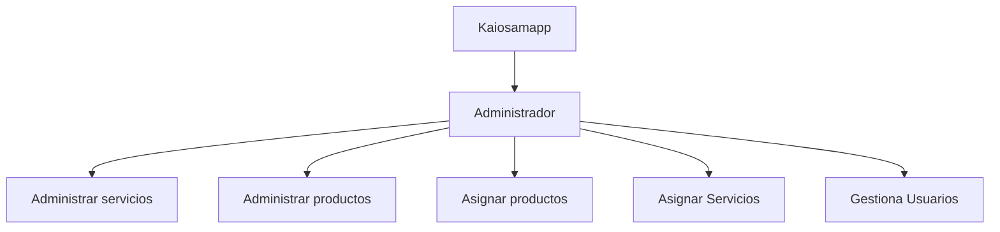

# Kaiosamapp 🌏🌐

## Tabla de contenido
| Indice | Título  |
|--|--|
| 1. | [Descripción](#Descripcion) |
| 2. | [Características](#Características) |
| 3. | [Tecnologías Utilizadas](#Tecnologias) |
| 4. | [Uso del Repositorio](#Uso) |
| 5. | [Instrucciones de Ejecución](#Instrucciones) |
| 6. | [Contacto](#Contacto) |

## Descripcion🚀

El proyecto kaiosamapp es una plataforma de gestión integral para una empresa de servicios de telefonia, diseñada para administrar diferentes aspectos relacionados con servicios, productos y gestion de descuentos. Esta aplicación permite a los administradores gestionar los datos pertinentes.

## Características🧮

1. **Gestión de Usuarios** 👥: Permite registrar y gestionar cuentas de los clientes y sus planes.

2. **Gestión de Servicios** 🌐: Permite la creación, lectura, edición y eliminación de servicios.

3. **Gestión de Productos** 🌐: Permite la creación, lectura, edición y eliminación de productos.

## Tecnologias🖥️

- **Python** 🐍: Todas la aplicacion esta hecha con python.

## Uso📝

Este repositorio contiene el código fuente del proyecto Kaiosamapp, organizado por roles y funcionalidades dentro de kaiosamapp. Cada directorio y archivo está estructurado para facilitar el desarrollo, mantenimiento y despliegue de la aplicación.

## Instrucciones📐

1. Clona el repositorio a tu máquina local. 
2. Configura adecuadamente todo lo adecuado drespecto a python.
3. Ejecuta el proyecto desde la terminal.

## Mapa 

## Autor 👤

Leonardo Gonzalez

## Contacto

darkleonardog@gmail.com
